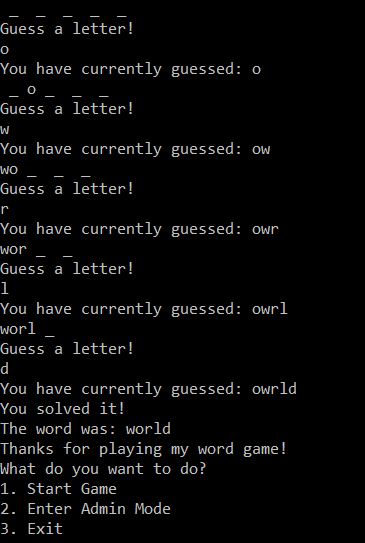

# Lab03-Word-Guess-Game

## Summary
This application is a game that has the user guess letters of a random word from a list of words.  
The user could also edit which words are in the game by going into the admin mode.  

## Visual
Here is how the application looks after figures out what the word is:  
  

## Instructions to Play
1. Download Visual Studio Community  
2. Clone the GitHub repository from this website: https://github.com/jimmychang94/Lab03-Word-Guess-Game  
3. Open Lab03-Word-Guess-Game.sln
4. Go to the Debug menu and click on the "Start Without Debugging" tab.
